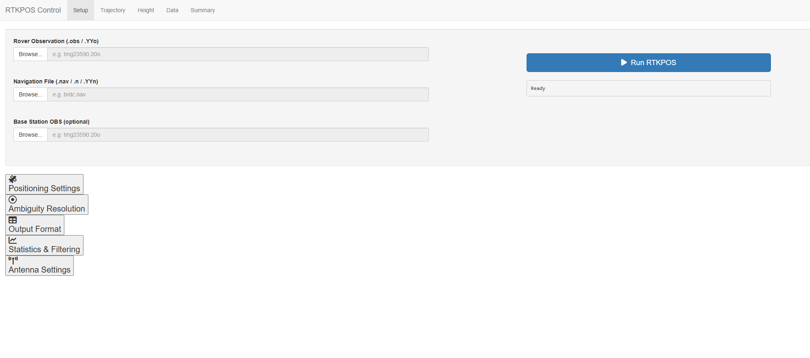
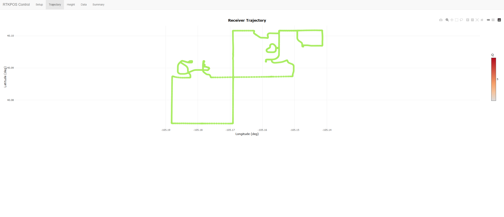
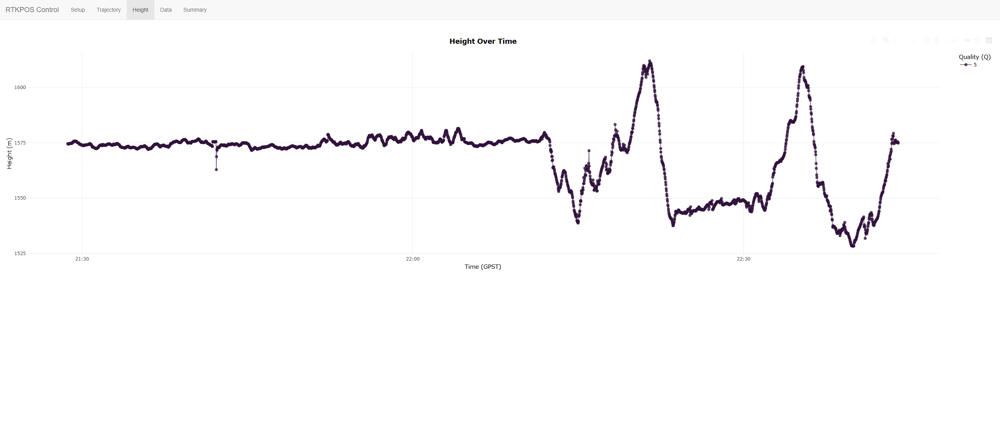
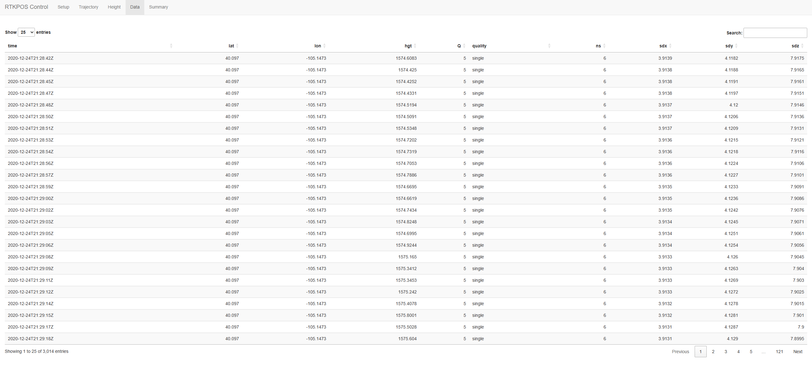
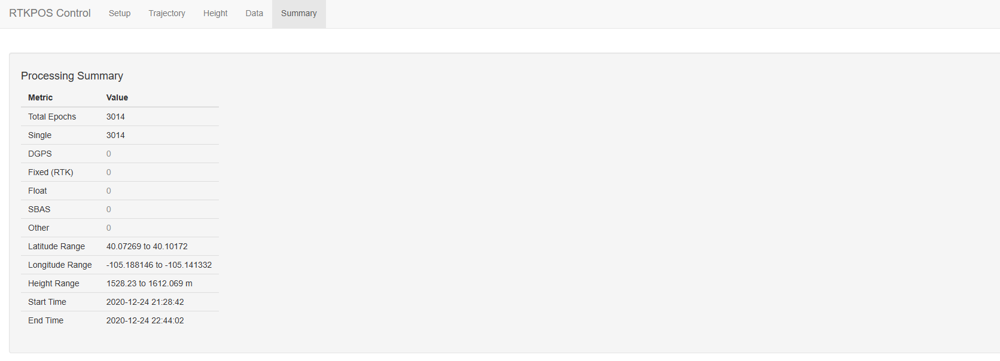

# 1 Introduction

Global Navigation Satellite Systems (GNSS) represent one of the most important technologies for modern positioning and navigation. Systems such as GPS, GLONASS, Galileo, and BeiDou provide worldwide positioning services and are used in applications ranging from personal navigation to high-precision geodetic measurements. While standard GNSS positioning generally achieves accuracies of several meters, many scientific and engineering applications require centimeter-level precision. Achieving such precision often requires post-processing of recorded observation data using advanced positioning algorithms.

RTKLIB is one of the most widely used open-source software packages for GNSS data processing. It contains a collection of tools capable of performing real-time and post-processed positioning using observations from multiple GNSS constellations. Among its utilities, the command-line application `rnx2rtkp` is commonly used for post-processing of RINEX observation files and generation of precise positioning solutions.

Despite its powerful capabilities, RTKLIB can be challenging for inexperienced users because it relies heavily on configuration files and command-line execution. Users must manually create configuration files, specify processing parameters, execute processing commands, and interpret generated output files. This workflow may be time-consuming and error-prone, particularly for users whose primary expertise is not GNSS data processing.

The objective of this project was therefore to develop software support in the R environment that simplifies the use of RTKPOS functionality. The developed solution provides automatic configuration management, execution of RTKLIB processing tools, output parsing, visualization capabilities, and an intuitive graphical user interface. The resulting application allows users to perform complete GNSS post-processing workflows without direct interaction with command-line tools.

The main goals of the project were:

* Integration of RTKPOS functionality into the R environment.
* Automatic generation of RTKLIB configuration files.
* Automated execution of the `rnx2rtkp` processing engine.
* Parsing and analysis of generated position solutions.
* Interactive visualization of positioning results.
* Development of a user-friendly graphical interface.

# 2 Theoretical Background

## 2.1 GNSS Post-Processing

GNSS positioning is based on measurements collected from satellites orbiting the Earth. Receivers record pseudorange and carrier-phase observations, which can later be processed to estimate precise receiver coordinates. While real-time positioning is sufficient for many applications, higher levels of accuracy are often achieved through post-processing.

Post-processing involves analyzing recorded observations after data collection has been completed. The recorded measurements are combined with navigation data and correction models to produce more accurate position estimates. Post-processing enables the use of advanced algorithms and quality control procedures that are difficult to implement in real-time systems.

Typical post-processing workflows utilize data from a rover receiver and, optionally, a reference base station. The base station provides correction information that reduces common errors affecting GNSS observations. Through differential processing techniques, positioning accuracy can be improved from meters to centimeters.

## 2.2 RINEX Data Format

The Receiver Independent Exchange Format (RINEX) is the standard format for exchanging GNSS observation and navigation data. It provides a receiver-independent representation of satellite measurements and enables interoperability between different hardware and software systems.

Observation files contain measurements collected by GNSS receivers, including pseudorange, carrier phase, Doppler frequency, and signal strength information. Navigation files contain satellite ephemerides and clock corrections required for position computation.

The developed application uses observation files from rover and base stations together with navigation files as input to the RTKPOS processing engine.

## 2.3 RTKLIB and RTKPOS

RTKLIB is an open-source software package designed for GNSS positioning applications. It supports multiple satellite constellations and a variety of positioning techniques including single-point positioning, differential GNSS, real-time kinematic (RTK), and precise point positioning (PPP).

The RTKPOS functionality is implemented through the `rnx2rtkp` command-line utility. This tool processes RINEX files and generates position solutions based on user-defined configuration parameters. The processing engine supports various positioning modes, ambiguity resolution strategies, atmospheric correction models, and output formats.

Because RTKLIB relies on text-based configuration files and command-line execution, it provides significant flexibility but can be difficult to use efficiently without additional software support. The purpose of the developed application is to bridge this gap by providing a modern interface built entirely within the R environment.

# 3 Software Design and Implementation

## 3.1 System Architecture

The developed software solution consists of two major subsystems: a backend processing layer and a graphical user interface layer.

The backend layer is responsible for communication with RTKLIB, configuration management, execution of processing tasks, parsing of generated output files, and creation of visualizations. The graphical user interface layer provides a user-friendly environment through which users interact with the application.

```text
User
  |
  V
Shiny GUI
  |
  V
Backend Functions
  |
  V
RTKLIB rnx2rtkp
  |
  V
POS Output Files
  |
  V
Parser
  |
  V
Visualization & Analysis
```

The modular architecture improves maintainability and allows future extensions without significant modifications to existing code.

## 3.2 Backend Implementation

The backend implementation is contained within the `rtkpos_backend.R` module. This component acts as a software bridge between R and RTKLIB.

The first major responsibility of the backend is configuration management. The function `get_default_params()` defines a complete set of RTKLIB configuration parameters. These parameters include positioning settings, ambiguity resolution settings, output formatting options, statistical models, and antenna definitions. Storing configuration values within R objects enables dynamic modification of processing settings directly from scripts or the graphical user interface.

The second responsibility is automatic configuration file generation. RTKLIB requires configuration files in a specific text format. The function `generate_config()` converts R parameter lists into valid RTKLIB configuration files. This eliminates the need for manual editing and improves reproducibility of processing workflows.

The third responsibility is execution of RTKPOS processing. The function `run_rtkpos()` automatically locates the `rnx2rtkp` executable, validates input files, generates configuration files if necessary, constructs command-line arguments, and executes the processing task using R's `system2()` function. Standard output and error messages are captured and returned to the user for inspection.

Another important component is the output parser implemented through the `parse_rtkpos_output()` function. RTKLIB generates text-based solution files that are not immediately suitable for analysis. The parser converts these files into structured R data frames containing timestamps, coordinates, quality indicators, satellite counts, and statistical information. This enables direct integration with R's data analysis ecosystem.

Finally, the backend provides visualization functions for graphical representation of positioning results. These functions generate trajectory plots and height-time diagrams using the ggplot2 package, allowing rapid assessment of solution quality and receiver behavior.

## 3.3 Graphical User Interface

To improve usability, a graphical user interface was implemented using the Shiny framework. The interface eliminates the need for direct interaction with RTKLIB command-line tools and provides a centralized environment for all processing tasks.

The interface consists of five primary tabs: Setup, Trajectory, Height, Data, and Summary.

The Setup tab allows users to select rover observation files, navigation files, and optional base station observations. It also provides access to all RTKLIB processing parameters through a series of organized configuration panels.

Figure 1 presents the main setup interface.

```{r fig1, echo=FALSE, out.width='100%'}

```
Figure 1: Main setup interface.

The Trajectory tab displays the calculated receiver path and enables interactive exploration of the generated solution.

```{r fig2, echo=FALSE, out.width='100%'}

```
Figure 2: Receiver trajectory generated from RTKPOS output.

The Height tab provides visualization of altitude changes over time.

```{r fig3, echo=FALSE, out.width='100%'}

```
Figure 3: Height variation over time.

The Data tab presents parsed positioning results in tabular form.

```{r fig4, echo=FALSE, out.width='100%'}

```
Figure 4: Parsed positioning results displayed in tabular form.

The Summary tab displays processing statistics, executed commands, and diagnostic information.

```{r fig5, echo=FALSE, out.width='100%'}

```
Figure 5: Processing summary and diagnostics.

# 4 Experimental Results and Evaluation

To evaluate the developed software, several GNSS datasets were processed using the implemented application. The testing procedure involved loading RINEX observation files, configuring processing parameters through the graphical interface, executing RTKPOS computations, and analyzing the generated results.

The software successfully generated RTKLIB configuration files, executed the processing engine, and produced valid position solutions. The generated output files were correctly parsed and transformed into R data frames suitable for further analysis.

The trajectory visualization demonstrated stable positioning behavior throughout the observation period. The graphical representation enabled rapid identification of solution quality and potential anomalies. Similarly, the height plot provided useful insight into vertical positioning performance and measurement stability.

The interactive data table allowed efficient inspection of individual observation epochs, while the summary tab provided complete transparency regarding processing parameters and execution details.

Overall, the testing confirmed that the developed software successfully performs all required tasks and provides a practical interface for GNSS post-processing workflows.

# 5 Discussion

The developed software offers several important advantages. First, it significantly reduces the complexity of RTKLIB usage by eliminating the need for manual configuration file editing. Second, it provides direct integration with the R ecosystem, enabling users to combine GNSS processing with advanced statistical analysis and visualization techniques. Third, the graphical interface makes the software accessible to users with limited experience in command-line applications.

The modular architecture adopted during development simplifies maintenance and future extension of the software. Additional RTKLIB parameters, visualization methods, and processing modes can be incorporated with relatively minor modifications.

Despite these advantages, several limitations remain. The application depends on an external RTKLIB installation and therefore requires proper configuration of executable paths. Furthermore, processing of very large datasets may require optimization of memory usage and parsing procedures. Some advanced RTKLIB features are not yet exposed through the graphical interface and remain accessible only through manual configuration.

Future work may include implementation of GIS-based visualization, batch processing of multiple datasets, automated report generation, support for additional RTKLIB modules, and integration with spatial analysis packages such as `sf`, `terra`, and `leaflet`.

# 6 Conclusion

This project successfully developed software support for RTKPOS GNSS SDR post-processing within the R environment. The resulting solution provides a complete workflow for configuration management, execution of RTKLIB processing tasks, parsing of generated results, and visualization of positioning solutions.

The developed backend module establishes effective communication between R and the RTKLIB processing engine, while the Shiny-based graphical user interface significantly improves usability and accessibility. Users can perform complete GNSS post-processing workflows without direct interaction with configuration files or command-line tools.

Testing demonstrated successful operation of all implemented components, including configuration generation, RTKPOS execution, output parsing, data visualization, and interactive analysis. The project objectives were fully achieved and the resulting software represents a practical and extensible platform for GNSS data processing.

The developed solution demonstrates the suitability of R as a high-level environment for integrating external scientific software tools and provides a foundation for future development of advanced GNSS processing applications.

# References

1. Takasu, T. RTKLIB: An Open Source Program Package for GNSS Positioning.
2. RTKLIB Official Documentation.
3. Chang, W. Mastering Shiny.
4. Wickham, H., Grolemund, G. R for Data Science.
5. Kaplan, E., Hegarty, C. Understanding GPS/GNSS Principles and Applications.
6. Hofmann-Wellenhof, B., Lichtenegger, H., Wasle, E. GNSS – Global Navigation Satellite Systems.
7. R Core Team. R: A Language and Environment for Statistical Computing.
