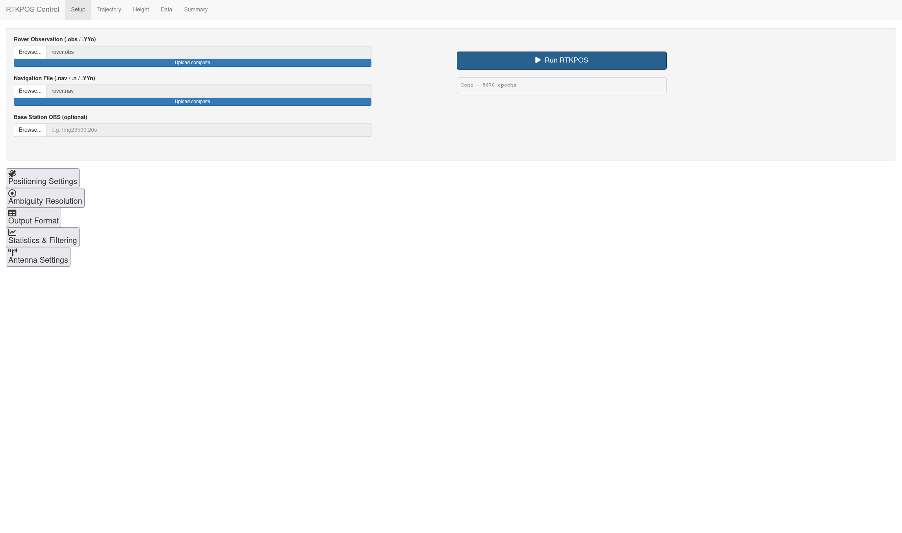
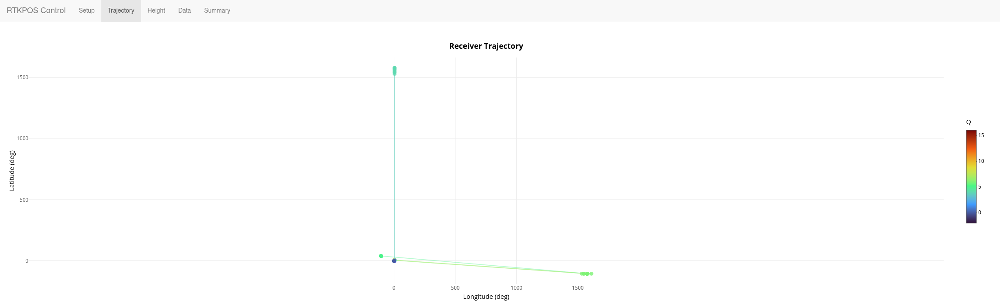
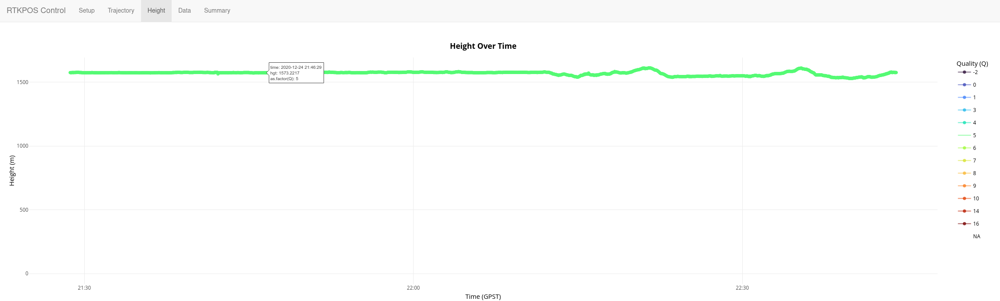
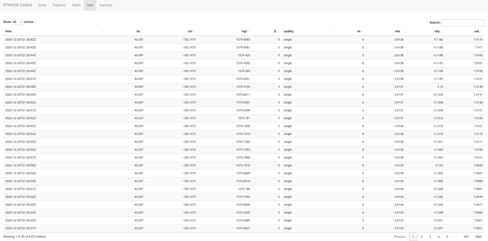
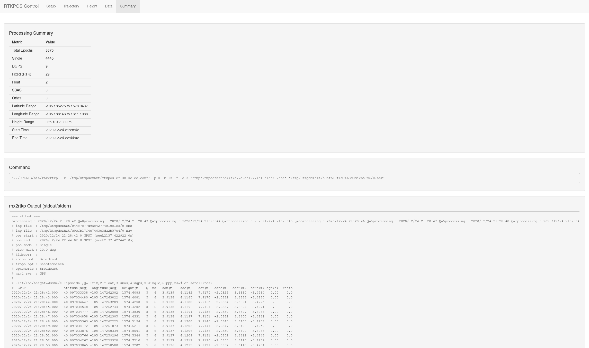

```{r setup, include=FALSE}
knitr::opts_chunk$set(echo = TRUE)
```
# Task
Software support for working with the RTKPOST post-processing GNSS SDR in the R environment.
Develop software support in the R environment that will enable the use of
the functionality of the RTKPOST software tool by calling, configuring and managing
it using an R script. Implement the software support with an appropriate graphical
user interface. Describe the method and software support in the technical report of
the project.

# Wrapper
A thin wrapper around the `rnx2rtkp` program is created with a simple function, including some convenience functions for finding the executable:
```
  if (is.null(rtkpos_exe)) {
    rtkpos_exe <- Sys.which("rnx2rtkp")
    if (rtkpos_exe == "") {
      candidates <- c(
        "C:/RTKLIB/bin/rnx2rtkp.exe",
        "C:/RTKLIB/RTKLIB_EX/bin/rnx2rtkp.exe",
        "C:/Program Files/RTKLIB/bin/rnx2rtkp.exe",
        "C:/RTKLIB-EX/bin/rnx2rtkp.exe",
        "../RTKLIB/bin/rnx2rtkp"
      )
      for (candidate in candidates) {
        if (file.exists(candidate)) {
          rtkpos_exe <- candidate
          break
        }
      }
    }
    if (rtkpos_exe == "") {
      stop(
        "rnx2rtkp executable not found.\n",
        "Install RTKLIB from: https://github.com/rtklibexplorer/RTKLIB/releases\n",
        "Or provide the full path via the 'rtkpos_exe' argument."
      )
    }
  }
```

# Visualization

# User Interface
A user interface was created using `shiny`.






